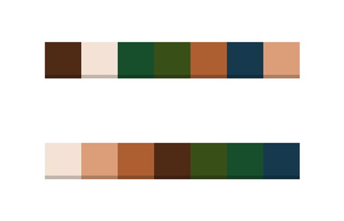

# color-sort-game
Lerp color by HSL / Shuffle color / Sort color / Checkwin  

游戏通过执行`colorGenerator (total1, total2)`来重置颜色 
参数 total1，total2 决定了颜色的数量：(total1 + total2 - 1)

Run `colorGenerator (total1, total2)` to reset the color array.  
The length of color array equals to (total1 + total2 - 1).  

